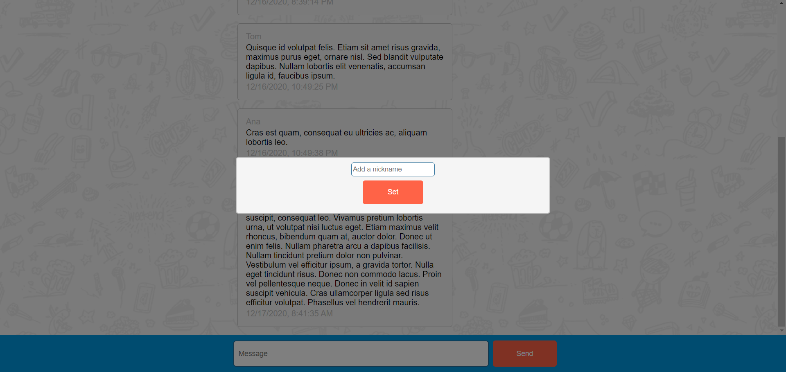
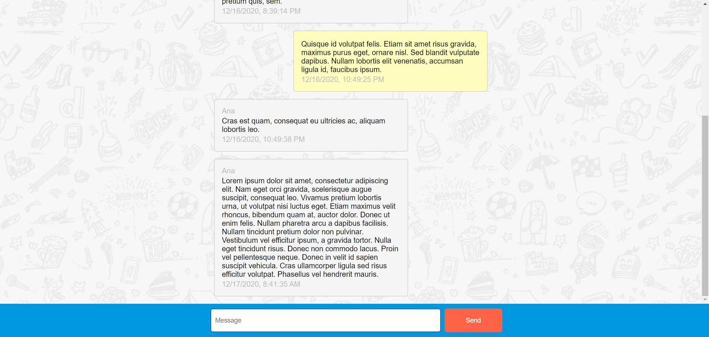

## Simple Chat Application

The user is first prompted to choose a nickname that will be associated with his messages and visible to other users.

After writing the nickname into the input, the modal will close and the user will be able to see previous messages in the chat window.
Users can write messages and add them to the chat window by clicking the 'Send' button or pressing the enter key.
User is also able to see other users' new messages.

